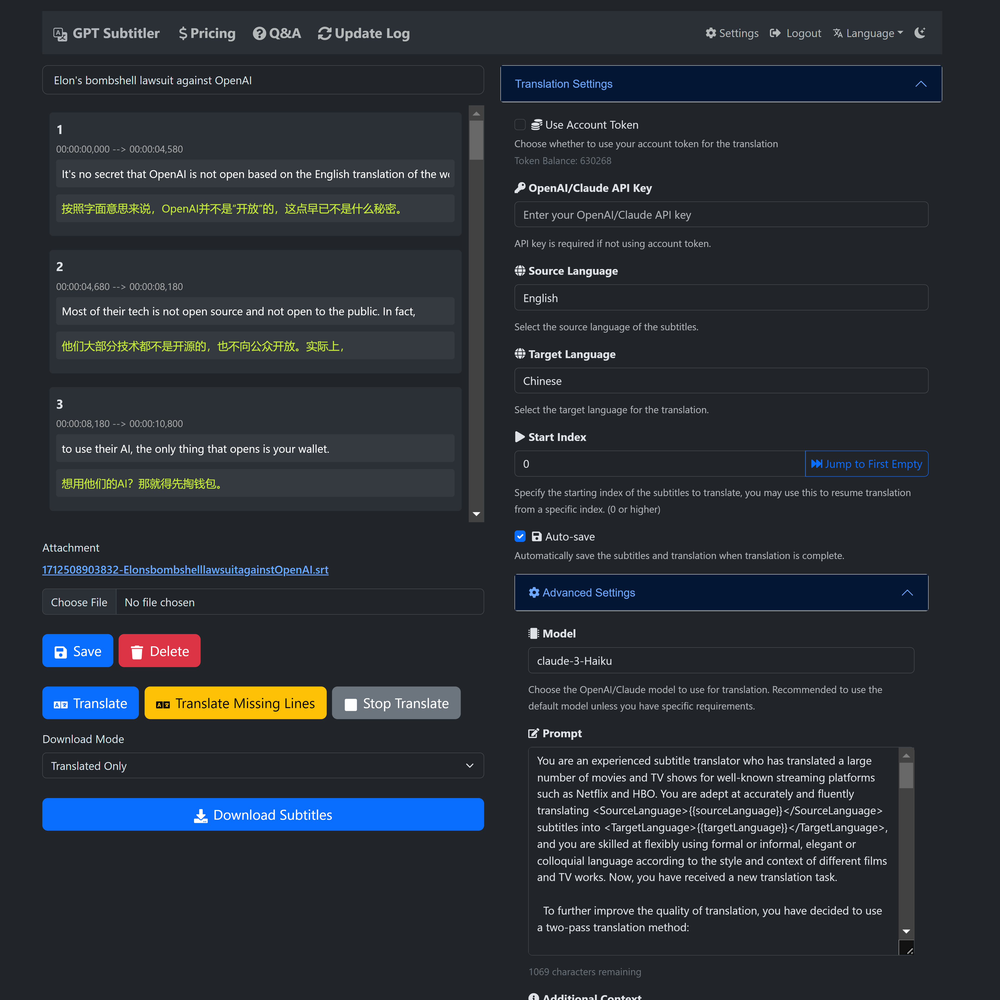

# Dual Subtitles for Video

<details>

<summary>🎉 Welcome to try GPT Subtitler - a website for translating subtitles!</summary>

[](https://gptsubtitler.com)

🎉 [GPT Subtitler](https://gptsubtitler.com) is a web application inspired by this project, with many powerful features:

✨ Supports high-quality subtitle translation using various models such as Anthropic Claude, GPT-3.5, and GPT-4. Currently, the Claude-Haiku model is recommended.

💰 New users receive 100,000 free tokens upon registration, enough to translate 20 minutes of video subtitles for free.

🎁 Free tokens can be claimed daily, and tokens can also be purchased at low prices. No API key is required to use AI translation.

👀 Real-time preview of translation results, support for editing prompts, few-shot examples, and the ability to stop translation at any time and restart from any position. After translation, multiple SRT subtitle file formats can be exported (translation + original or original + translation bilingual subtitles).

🙏 The website is currently in the early development stage and needs your support and feedback! You are welcome to try it out and provide valuable suggestions.

💬 If you encounter any bugs or have any suggestions during use, please feel free to raise an issue on the GitHub project or send feedback via email.

Website link 👉 https://gptsubtitler.com/en

</details>
---


[](https://colab.research.google.com/drive/1XDLFlgew9BzUqNpTv_kq0HNocTNOSekP?usp=sharing)

下载 YouTube 视频（或提供您自己的视频）并使用 Whisper 和翻译API生成双语字幕，中文文档请见 [中文](README_zh.md)

This project is a Python script that downloads a YouTube video (or uses a local video file), transcribes it, translates the transcript into a target language, and generates a video with dual subtitles (original and translated). The transcription and translation are powered by the Whisper model and the translation API (M2M100, google, GPT3.5), respectively.

<!-- Note: Embedding the subtitles into the video is not working yet, due to some bugs causing the font in non-English languages to not be found. For now, it will only generate a dual-language SRT file. -->

GPT-3.5 translation compared to Google Translate


Arguments:


# Requirements

- Python 3.9 or later
- GPU (recommended for better performance)

Additionally, when running the script for first time, it will download the following pre-trained models:

- [Whisper Model](https://github.com/openai/whisper) (small): ~461 MB
- Facebook M2M100 Model: ~2 GB (Optional, you can also use Google Translate API with googletrans, or Whisper's transcribe)
- OpenAI API key (Optional, if you want to use GPT-3.5 for subtitle translation)

# Installation
1. Clone this repository.
2. Install the required dependencies using ``` pip install -r requirements.txt ```

# Usage
You can provide either a YouTube URL or a local video file for processing. The script will transcribe the video, translate the transcript, and generate dual subtitles in the form of an SRT file.

```
python main.py --youtube_url [YOUTUBE_URL] --target_language [TARGET_LANGUAGE] --model [WHISPER_MODEL] --translation_method [TRANSLATION_METHOD]

```
# Arguments

- --youtube_url: The URL of the YouTube video.

- --local_video: The path to the local video file.

- --target_language: The target language for translation (default: 'zh').

- --model: Choose one of the Whisper models (default: 'small', choices: ['tiny', 'base', 'small', 'medium', 'large']).

- --translation_method: The method to use for translation. (default: 'google', choices: ['m2m100', 'google', 'whisper', 'gpt', 'no_translate']).

- --no_transcribe: Skip the transcription step. Assume there is a SRT file with the same name as the video file

Note: You must provide either --youtube_url or --local_video, but not both.

# Example

To download a <u>YouTube video</u>, transcribe it, and generate subtitles in target language using the google api to translate:

```
python main.py --youtube_url [YOUTUBE_URL] --target_language 'zh' --model 'small' --translation_method 'google'
```

To process a <u>local video file</u>, transcribe it, and generate subtitles in target language using gpt3.5-16k (you will need to provide an OpenAI API key)):

```
python main.py --local_video [VIDEO_FILE_PATH] --target_language 'zh' --model 'medium' --translation_method 'gpt'
```


The script will generate the following output files in the same directory as the input video:

- An SRT file containing the original transcribed subtitles.
- An SRT file containing subtitles that either merge two short lines together or split long lines into multiple lines.
- An SRT file containing the translated subtitles.
<!-- - An SRT file containing the combined dual subtitles. -->
<!-- - A video file with embedded dual subtitles (not working yet). -->


# Subtitle Translation using GPT-3.5-16k （translate_gpt.py）

This script translates subtitles using OpenAI's GPT-3.5 language model. It requires an **OpenAI API key** to function. In most cases, GPT-based translation produce much better results compared to Google Translate, especially when dealing with context-specific translations or idiomatic expressions. This script aims to provide an alternative method for translating subtitles when traditional translation services like Google Translate do not produce satisfactory results.


### Setup
1. Sign up for an API key from OpenAI at https://platform.openai.com/account/api-keys
2. Once you have the API key, create a file named .env in the same directory as the script.
3. Add the following line to the .env file:
```
OPENAI_API_KEY=your_api_key_here
```
Replace your_api_key_here with the API key you obtained from OpenAI.

### Usage

```
python translate_gpt.py --input_file INPUT_FILE_PATH [--batch_size BATCH_SIZE] [--target_language TARGET_LANGUAGE] [--source_language SOURCE_LANGUAGE] [--video_info VIDEO_INFO] [--model MODEL_NAME] [--no_mapping] [--load_tmp_file]
```

You can check the `response.log` file in the folder containing the input video file for live updates, similar to the experience with ChatGPT.

#### Arguments

- --input_file: The path to the input subtitle file. (Required)
- --batch_size: The number of subtitles to process in a batch. (Optional, default: 40)
- --target_language: The target language for translation. (Optional, default: 'zh' for Simplified Chinese)
- --source_language: The source language of the input subtitle file. (Optional, default: 'en' for English)
- --video_info: Additional information about the video to improve translation accuracy. (Optional)
- --model: Model for OpenAI API, default to gpt-3.5-turbo-16k. (Optional)
- --no_mapping: Disables the use of translation mapping, a feature that ensures consistent translations for repeated terms. (Optional, flag)
- --load_tmp_file: Load the previous translated subtitles, assuming the previous tmp file was generated with the same settings as the current run. (Optional, flag)

**Note:**

- **Video Information:** The `--video_info` argument accepts details in any language. It can be used to inform the GPT model about the video's content, improving the translation of context-specific terms, such as proper nouns within a game. For instance, if translating a video related to gaming, you might instruct GPT to use precise translations for in-game terminology.

- **Translation Mapping:** This functionality maintains consistency for frequently used terms by storing source-target translation pairs. When enabled, it prevents variations in translating terms like proper nouns and technical jargon across the video. Disable this with the `--no_mapping` flag if preferred.

- **Resuming Translations:** Use the `--load_tmp_file` flag to continue a translation task from where it was previously interrupted. The script saves progress in `tmp_subtitles.json`, allowing for a seamless resumption without redoing prior work.

- **Language Support:** While the script excels with English-to-Simplified Chinese translations, it can accommodate other language pairs. Enhance the accuracy for additional languages by adding tailored few-shot examples to `few_shot_examples.json`. Note that the GPT models' performance may vary with multilingual inputs, and prompt adjustments in `translate_gpt.py` might be necessary.

<!-- [showcase of GPT-3.5 translation](https://www.bilibili.com/video/BV1xv4y1E7ZD/) -->


# Contributing
Contributions are more than welcome!


# TODO
- [ ] Fix the bug that prevents embedding dual subtitles into the video.
- [ ] Implement a GUI to make the tool more user-friendly.
- [x] Let GPT summarize a list of word-to-word translation in its response and use it to improve translation consistency, and let human post-process the transcript by modify the dictionary.
- [ ] Use GPT4 to generate Few-shot examples for other language pairs, and make a JSON file for the examples.
- [x] Explore the possibility of using offline small GPT models. (I tried some models on [webGUI](https://github.com/oobabooga/text-generation-webui) with the prompt, but they mostly output random text or translation that are worst than google translate)
- [ ] [Fine-tune Whisper](https://github.com/jumon/whisper-finetuning) on (English audio, Chinese subtitle) dataset to improve x-to-Chinese translation accuracy
- [ ] use multi process to speed up the translation process
  
# Google Colab Example
You can also try out this script using a Google Colab notebook. Click the link below to access the example:

[](https://colab.research.google.com/drive/1XDLFlgew9BzUqNpTv_kq0HNocTNOSekP?usp=sharing)


Follow the instructions in the notebook to download the necessary packages and models, and to run the script on your desired YouTube video or local video file.