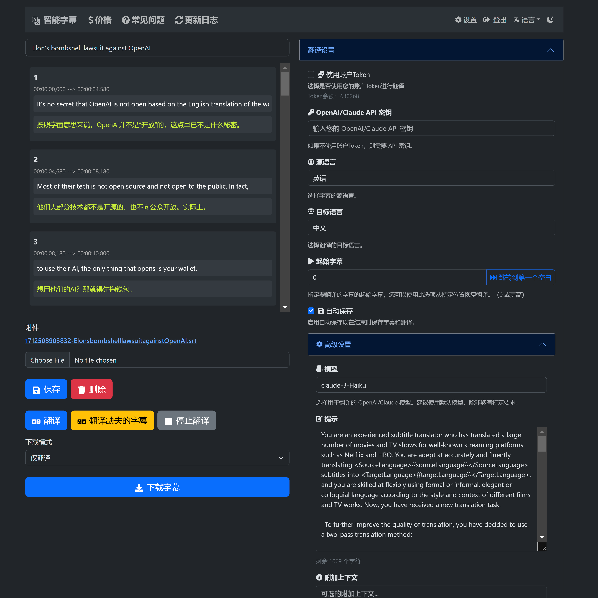

# 视频双语字幕


<details>

  <summary>🎉 欢迎试用 GPT Subtitler 字幕翻译网站!</summary>

  [](https://gptsubtitler.com)

  🎉 [GPT Subtitler](https://gptsubtitler.com) 是一个受本项目启发而开发的 Web 应用，拥有众多强大功能:

  ✨ 支持使用 Anthropic Claude、GPT-3.5 和 GPT-4 等多种模型进行高质量字幕翻译，目前推荐使用 Claude-Haiku 模型  

  💰 新用户注册立即送10万免费 Token，足够免费翻译20分钟视频字幕  

  🎁 每日可领取免费 Token，也可低价购买 Token，无需 API 密钥即可使用 AI 翻译  

  👀 实时预览翻译结果，支持编辑提示词，小样本实例，以及随时停止翻译和在任意位置重启的功能，可在翻译结束后导出多种 SRT 字幕文件格式（翻译+原文 或 原文+翻译的双语字幕）  

  🙏 网站目前处于早期开发阶段，很需要您的支持和反馈!欢迎体验并提供宝贵意见  

  💬 使用过程中如遇到 BUG 或有任何建议，欢迎在 GitHub 项目中提 Issue 或发送邮件反馈  

  网站指路 👉 https://gptsubtitler.com/zh

</details>

---

[](https://colab.research.google.com/drive/1XDLFlgew9BzUqNpTv_kq0HNocTNOSekP?usp=sharing)

此文档由GPT翻译生成

下载 YouTube 视频（或提供您自己的视频）并使用 Whisper 和翻译 API 生成双语字幕

这个项目是一个 Python 脚本，它可以下载 YouTube 视频（或使用本地视频文件），将其转录文本，并将文本翻译成目标语言，转录和翻译分别由 Whisper 模型和翻译 API（M2M100、google、GPT3.5）提供支持。

<!--注意：由于某些错误导致非英语语言字体无法找到，因此将字幕嵌入到视频中目前还无法实现。目前只能生成双语言的 SRT 文件。-->

GPT-3.5 翻译与 Google 翻译的比较


参数：


# 要求

- Python 3.9 或更新版本
- GPU（建议以获得更好的性能）

另外，当您首次运行脚本时，它会下载以下预训练模型：

- [Whisper 模型](https://github.com/openai/whisper)（小型）：约 461 MB
- Facebook M2M100 模型：约 2 GB（可选，您也可以使用 googletrans 的 Google 翻译 API 或 Whisper 的转录）
- OpenAI API 密钥（可选，如果您想使用 GPT-3.5 进行字幕翻译）


# 安装
1. 克隆此存储库。
2. 使用 ``` pip install -r requirements.txt ``` 命令安装所需的依赖项。

# 用法
您可以提供 YouTube URL 或本地视频文件进行处理。该脚本会将视频转录为文本，将文本翻译，并生成双语字幕的 SRT 文件。

```
python main.py --youtube_url [YOUTUBE_URL] --target_language [TARGET_LANGUAGE] --model [WHISPER_MODEL] --translation_method [TRANSLATION_METHOD]

```
# 参数

---youtube_url：YouTube 视频的 URL。

--local_video：本地视频文件的路径。

--target_language：翻译的目标语言（默认为 'zh'）。

--model：选择 Whisper 模型之一（默认为 'small'，可选值：['tiny'，'base'，'small'，'medium'，'large']）。

--translation_method：翻译的方法（默认为 'm2m100'，可选值：['m2m100'，'google'，'whisper'，'gpt']）。


注意：必须提供 --youtube_url 或 --local_video，但不能同时提供两者。

# 示例

下载一个 YouTube 视频，转录并生成目标语言的字幕，并使用 Google API 进行翻译：

```
python main.py --youtube_url [YOUTUBE_URL] --target_language 'zh' --model 'small' --translation_method 'google'
```

要处理本地视频文件，转录并生成目标语言的字幕，并使用 gpt3.5-16k 进行翻译（您需要提供 OpenAI API 密钥）：

```
python main.py --local_video [VIDEO_FILE_PATH] --target_language 'zh' --model 'medium' --translation_method 'gpt'
```


脚本将在与输入视频相同的目录中生成以下输出文件：

- 包含原始转录字幕的 SRT 文件。
- 包含翻译字幕的 SRT 文件。
- 包含合并双语字幕的 SRT 文件。
- 嵌入双语字幕的视频文件（目前尚不可用）。


# 使用 GPT-3.5-16k 进行字幕翻译（translate_gpt.py）

此脚本使用 OpenAI 的 GPT-3.5 语言模型进行字幕翻译。它需要一个 **OpenAI API 密钥** 来工作。在大多数情况下，与 Google 翻译相比，基于 GPT 的翻译在处理上下文相关翻译或习语表达时会产生更好的结果。该脚本旨在提供一种替代方法，用于在传统翻译服务如 Google 翻译无法产生满意结果时翻译字幕。


### 设置
1. 在 https://platform.openai.com/account/api-keys 上注册一个 OpenAI API 密钥。
2. 获得 API 密钥后，在与脚本相同的目录中创建一个名为 .env 的文件。
3. 在 .env 文件中添加以下行：
```
OPENAI_API_KEY=your_api_key_here
```
将 your_api_key_here 替换为您从 OpenAI 获得的 API 密钥。

### 用法

```
python translate_gpt.py --input_file INPUT_FILE_PATH [--batch_size BATCH_SIZE] [--target_language TARGET_LANGUAGE] [--source_language SOURCE_LANGUAGE] [--video_info VIDEO_INFO] [--model MODEL_NAME] [--no_mapping] [--load_tmp_file]
```

在视频所在的文件夹中，您可以查看名为 `response.log` 的文件，该文件会实时更新翻译进度，就像在 ChatGPT 中一样。

### 参数

- --input_file：输入字幕文件的路径。（必填）
- --batch_size：一次处理的字幕数。（可选，默认值：12）
- --target_language：翻译的目标语言。（可选，默认值：'zh'，即简体中文）
- --source_language：输入字幕文件的源语言。（可选，默认值：'en'，即英语）
- --video_info：您可以提供有关视频的一些附加信息以提高翻译准确性。（可选）
- --model：OpenAI API 的模型，默认为 gpt-3.5-turbo-16k。（可选）
- --no_mapping：不使用翻译映射功能，该功能确保重复术语的一致翻译。（可选）
- --load_tmp_file：当先前的运行被中断时使用，无论是由于触发错误还是在检测到翻译不佳后手动终止，脚本会保存所有之前批次的翻译在 tmp_subtitles.json 并使用此标志重新加载保存的翻译并从下一个批次继续。（可选）

**注意：**

- **视频信息：** `--video_info` 参数可以包含任何语言的详细信息。它可以用来告知 GPT 模型视频的内容，以提高特定上下文术语的翻译质量，比如游戏中的专有名词。例如，如果你正在翻译一部关于游戏的视频，你可以指导 GPT 准确翻译游戏术语，或者使用你提供的确切专有名词来翻译。

- **翻译映射：** 通过存储源语言与目标语言翻译对的词典，此功能确保视频中反复出现的特定单词或短语的翻译保持一致。如果你偏好不使用这些预设的翻译映射，请使用 `--no_mapping` 标志来禁用此功能。

- **继续翻译：** 如果之前的运行被中断，无论是因为错误还是在检测到翻译不佳后手动停止，都可以使用 `--load_tmp_file` 标志。脚本会将所有已完成的翻译保存在 `tmp_subtitles.json` 文件中，使用此标志将允许脚本重新加载保存的翻译，并从下一批次继续。

- **语言支持：** 虽然该脚本在将英语翻译成简体中文时表现最佳，但它也支持其他语言对。通过在 `few_shot_examples.json` 中添加定制的 few-shot 示例来提高额外语言的翻译准确性。请注意，GPT 模型处理多语言输入的性能可能会有所不同，可能需要调整 `translate_gpt.py` 中的提示。

<!-- [GPT-3.5 翻译演示](https://www.bilibili.com/video/BV1xv4y1E7ZD/) -->


# 贡献
欢迎贡献！


# 待办事项
- [ ] 修复防止将双字幕嵌入视频的错误。
- [ ] 实现图形用户界面，使工具更易于使用。
- [x] 让 GPT 在其响应中总结一系列词对译，并使用它来提高翻译的一致性，并让人工通过修改字典来后处理转录。
- [ ] 使用 GPT4 为其他语言对生成Few-shot示例，并为这些示例创建一个JSON文件。
- [x] 探索使用离线的小型GPT模型的可能性。（我在[webGUI](https://github.com/oobabooga/text-generation-webui)上试了一些模型和提示，但它们大多输出随机文本或比谷歌翻译更糟糕的翻译）
- [ ] 在（英语音频，中文字幕）数据集上对[Whisper](https://github.com/jumon/whisper-finetuning)进行微调，以提高x-to-Chinese翻译的准确性
- [ ] 使用多进程加快翻译过程

# Google Colab示例
您也可以使用Google Colab笔记本尝试此脚本。点击下面的链接访问示例：

[](https://colab.research.google.com/drive/1XDLFlgew9BzUqNpTv_kq0HNocTNOSekP?usp=sharing)

按照笔记本中的说明下载必要的软件包和模型，并在所需的YouTube视频或本地视频文件上运行脚本。
